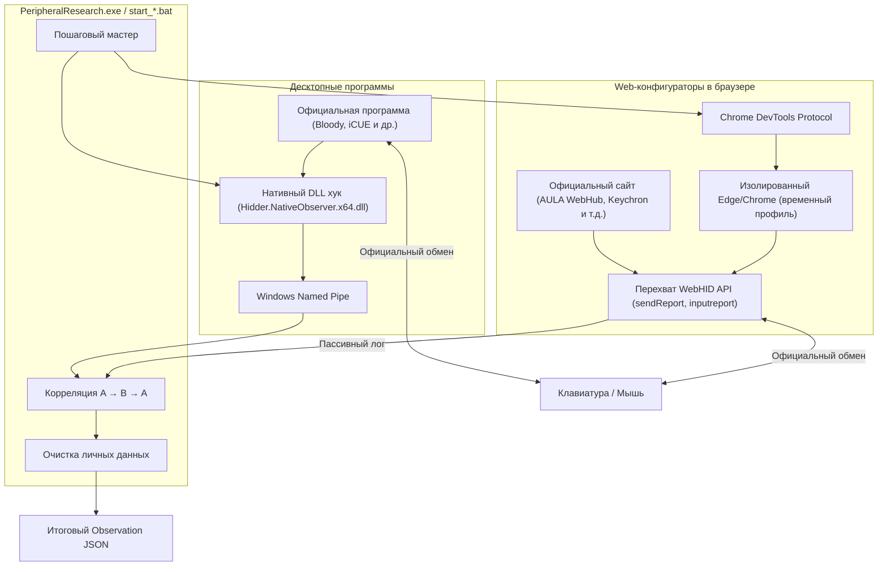

# Hidder — Research Probe for Vetro HUD

[]()
[]()
[]()
[]()

> 💡 **Вспомогательный инструмент для [Vetro HUD](https://github.com/Phnem/Vetro-hud)**  
> Этот скрипт создан для сбора технических дампов протоколов клавиатур и мышей (Rapid Trigger, точки срабатывания, частота опроса, подсветка).  
> У меня нет физического доступа ко всем существующим девайсам, поэтому запуск этого 5-минутного теста владельцами редких или новых моделей **очень сильно помогает добавить поддержку вашего устройства в Vetro HUD**.

---

### 🛡️ Скачивание и Безопасность / Download & Security

* **Готовые сборки**: Скачайте готовый `.exe` во вкладке [**Releases**](https://github.com/Phnem/Hidder/releases):
  * `PeripheralResearch_ru.exe` (на русском)
  * `PeripheralResearch_en.exe` (на английском)
* **Проверка VirusTotal**: [VirusTotal Scan Report](https://www.virustotal.com/gui/file/db0af4862b66a85d742bc97bc9f13ca034cdb34a276170896a0f8f54fc113456/detection)
* **Не доверяете скомпилированным EXE?** Клонируйте репозиторий, проверьте открытый исходный код и запустите скрипт напрямую:
  * `start_ru.bat` — русский интерфейс
  * `start_en.bat` — английский интерфейс

  Скрипты автоматически настроят локальное окружение Python (`.venv`) и запустят утилиту **напрямую из исходников**.

---

## 📸 Как выглядит процесс

| 1. Выбор подключённого девайса | 2. Подключение к софту / Web-конфигуратору |
| :---: | :---: |
|  |  |

| 3. Пошаговые действия и итоговый JSON |
| :---: |
|  |

---

## 🎯 Чем этот тест помогает проекту

Большинство производителей (AULA, ATK, DrunkDeer, Lamzu, Attack Shark, Keychron, Bloody и др.) используют закрытые USB HID команды.

Чтобы поддержать настройки конкретной клавиатуры или мыши в Vetro HUD, нужно знать структуру пакетов:
1. Вы запускаете утилиту (~5 минут).
2. Выбираете тип устройства и способ настройки (браузерный WebHID или официальная программа).
3. По подсказкам на экране меняете пару настроек (например, переключаете подсветку или меняете actuation point).
4. Утилита **пассивно слушает** трафик официального конфигуратора и сохраняет один итоговый `.json` файл.
5. Вы отправляете этот JSON мне в Telegram ([@Phnem_pro](https://t.me/Phnem_pro)) или прикрепляете к Issue.

---

## 🔒 Безопасность и конфиденциальность

* ❌ **Никаких записей в устройство**: утилита **никогда не отправляет** свои команды в ваше устройство. Запись в железо делает только официальный софт вендора; утилита только пассивно слушает.
* ❌ **Никакого кейлоггинга**: обычный набор текста, пароли и символы не перехватываются и не логируются.
* ❌ **Серийные номера удаляются**: USB Serial Number и персональные пути автоматически вырезаются из JSON перед сохранением.
* ❌ **Без установки в систему**: утилита не ставит служб, драйверов и не трогает автозагрузку.

---

## 🏗️ Как устроен сбор данных (Архитектура)

Утилита поддерживает два сценария наблюдения в зависимости от того, как настраивается девайс:



1. **WebHID режим (для сайтов-конфигураторов)**:
   * Открывает окно браузера с чистым временным профилем.
   * Через CDP прозрачно перехватывает вызовы `sendReport` и `inputreport`.
   * Полностью удаляет временный профиль браузера при закрытии.
2. **Native Desktop режим (для установленных программ)**:
   * Подключается к выбранному процессу с вашего явного согласия.
   * Фильтрует пакеты исключительно по целевому VID/PID вашего устройства.
3. **Корреляция $A \rightarrow B \rightarrow A$**:
   * Сравнивает состояние «до изменения», «во время изменения» и «после возврата», точно определяя байты и таблицы параметров (например, Rapid Trigger).

---

## 🚀 Как запустить

### Вариант 1: Готовый EXE (самый простой)
1. Скачайте `PeripheralResearch_ru.exe` (или `_en.exe`) со страницы [Releases](https://github.com/Phnem/Hidder/releases).
2. Запустите двойным кликом.
3. Следуйте подсказкам мастера (~5 минут).
4. Отправьте полученный `.json` файл автору: Telegram [@Phnem_pro](https://t.me/Phnem_pro).

### Вариант 2: Запуск из исходного кода
1. Склонируйте репозиторий:
   ```cmd
   git clone https://github.com/Phnem/Hidder.git
   cd Hidder
   ```
2. Запустите батник:
   * `start_ru.bat` (русский)
   * `start_en.bat` (английский)

---

## 🛠️ Сборка бинарников из исходников

### Требования
* Windows 10/11 x64
* Python 3.10+
* Rust toolchain (`cargo`, `rustc`)
* PyInstaller (`pip install pyinstaller pytest pefile`)

### Команда сборки
```cmd
python community/build_exe.py
```
Собранные бинарники и файл манифеста появятся в `community/dist/`.

### Запуск тестов
```cmd
python -m pytest -v community/tests DB/protocol-miner/tests
```

---

## 📄 Лицензия

Проект распространяется под открытой лицензией MIT.
