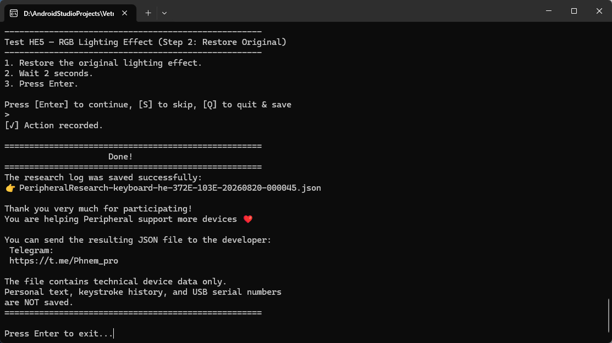
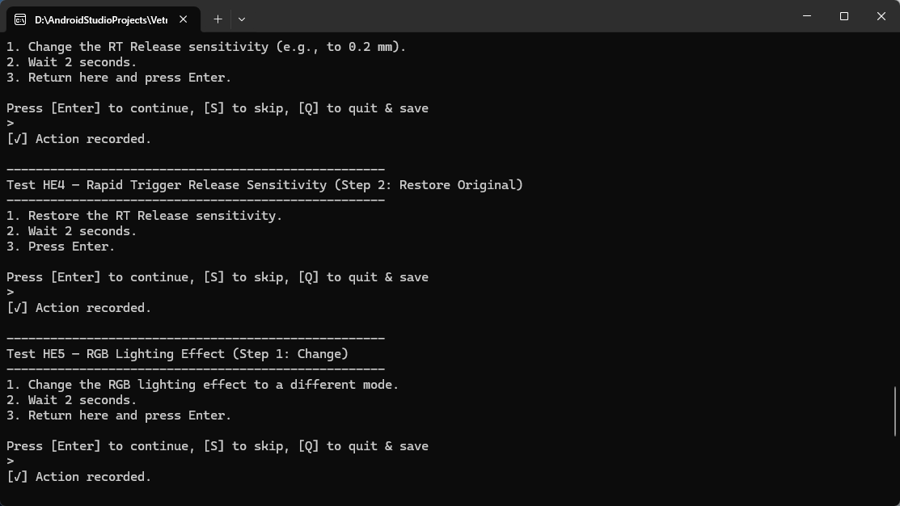
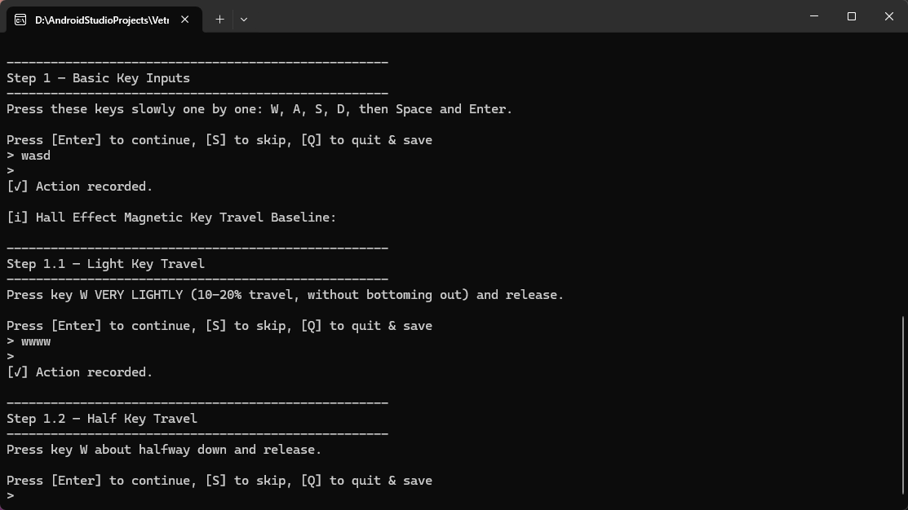
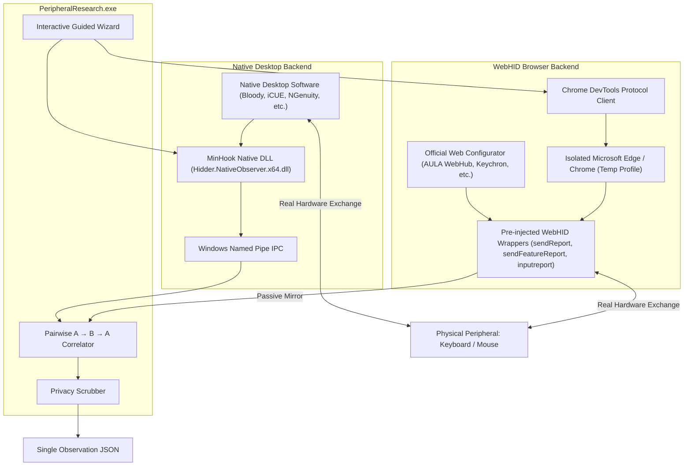

# Hidder — Peripheral Research Probe

[]()
[]()
[]()
[]()

**Hidder** (*Peripheral Research Probe*) is a portable, zero-install research tool designed to passively observe, record, and decode proprietary USB HID and WebHID device protocols from official keyboard and mouse software.

It allows gamers and community contributors to run a simple, 5-minute guided session that captures technical protocol payloads (Rapid Trigger, actuation depth, polling rate, DPI, debounce, lighting effects) to help add native support for devices in open-source peripheral drivers and utilities.

---

## 📸 Screenshots

| 1. Device Discovery & Selection | 2. WebHID & Desktop Observation |
| :---: | :---: |
|  |  |

| 3. Guided Action Windows & Final Export |
| :---: |
|  |

---

## ⚡ Why Hidder?

Most gaming peripherals (AULA, ATK, DrunkDeer, Lamzu, Attack Shark, Keychron, Bloody, Corsair, etc.) use proprietary USB HID protocols to configure hardware settings. Without technical protocol documentation, reverse-engineering requires expensive hardware or manual packet inspection.

**Hidder solves this by providing:**
* **5-Minute Guided Flow**: Step-by-step instructions for non-technical users.
* **One-File Executable**: Single standalone `.exe` without Python or dependency requirements.
* **Zero Hardware Risk**: Hidder **never** sends raw HID writes to your device. Official vendor software is the only writer; Hidder is purely a passive observer.
* **Privacy by Design**: Automatically scrubs personal data, usernames, Windows file paths, IPs, emails, and device serial numbers.

---

## 🏗️ How It Works (Architecture)

Hidder features two specialized observer backends tailored to modern device software:



### 1. WebHID Observer (for Web-based Configurators)
* Launches an isolated browser instance (Microsoft Edge or Google Chrome) using a clean temporary profile directory.
* Pre-injects transparent JavaScript wrappers via CDP (`Page.addScriptToEvaluateOnNewDocument`) before page scripts execute.
* Observes outbound reports (`sendReport`, `sendFeatureReport`), inbound features (`receiveFeatureReport`), and incoming analog streams (`inputreport`).
* Calls original methods with exact `this` binding and unchanged arguments (`apply`).
* Completely cleans up and deletes the temporary profile on exit.
* **Zero remote process APIs**: Does not call `OpenProcess`, `VirtualAllocEx`, `WriteProcessMemory`, or `CreateRemoteThread`.

### 2. Native Desktop Observer (for Installed Desktop Apps)
* Injects a safe 64-bit Rust DLL utilizing **MinHook** (HDE64 instruction length disassembly).
* Hooks Win32 user-mode APIs: `WriteFile`, `HidD_SetFeature`, `HidD_GetFeature`, `HidD_SetOutputReport`, `HidD_GetInputReport`.
* Filters handles by target USB VID/PID using `HidD_GetAttributes` to avoid logging irrelevant file or socket operations.
* Streams events in real time over Windows Named Pipe `\\.\pipe\PeripheralResearch_Observer`.
* Cached in `%LOCALAPPDATA%\Hidder\Runtime\v0.3.0\Hidder.NativeObserver.x64.dll` with stable version metadata.

### 3. Pairwise $A \rightarrow B \rightarrow A$ Change/Restore Correlation
* Automatically pairs each change action (`*_change`) with its mandatory restore step (`*_restore`).
* Compares baseline state ($A$), modified state ($B$), and restored state ($A'$).
* Accurately extracts modified byte offsets and distinguishes full configuration tables (such as Rapid Trigger composite tables) from single-byte fields.

---

## 🔒 Privacy & Security Invariants

* ❌ **No Keystroke Logging**: Never records regular typing or text input.
* ❌ **No Serial Numbers**: USB serial numbers are filtered out.
* ❌ **No Browser Data**: Uses an empty temporary profile; personal cookies, history, and passwords are never accessed.
* ❌ **No Permanent Installation**: Does not install background services, drivers, or registry startup entries.
* ❌ **No Hardware Writes**: Does not emit raw writes or firmware modifications.
* ❌ **No Anti-AV Tricks**: Zero obfuscation, zero stealth injection, zero runtime API hashing.

---

## 🛡️ Security Verification & Transparency

Official releases provide complete source-to-binary traceability. You can verify the integrity of your download:

| Artifact | SHA-256 Checksum | Windows Defender Status |
| :--- | :--- | :--- |
| `PeripheralResearch_ru.exe` | See `build_manifest.json` | Clean (No threats) |
| `PeripheralResearch_en.exe` | See `build_manifest.json` | Clean (No threats) |
| `Hidder.NativeObserver.x64.dll` | `76605408aa3ca9b89aa3afaf09d264360333ee6c7ded661594d2219178732186` | Clean (No threats) |

> **Note on Windows SmartScreen**:
> As an independent, non-commercial open-source project without an expensive EV code-signing certificate, Windows SmartScreen may show an "Unrecognized app" prompt on first run until community reputation is established. This is normal for unsigned open-source binaries. All source code is 100% public and inspectable.

---

## 🚀 Quick Start

### 1. Download
Grab the latest release from the [Releases](https://github.com/Phnem/Hidder/releases) page:
* **Russian Edition**: `PeripheralResearch_ru.exe`
* **English Edition**: `PeripheralResearch_en.exe`

### 2. Run
1. Double-click the executable.
2. Select your device category (`Keyboard` or `Mouse`).
3. If Keyboard, choose `Mechanical` or `Hall Effect (Rapid Trigger)`.
4. Enter your device model (e.g., `AULA HERO 84 HE`).
5. Choose your software type:
   * `[1] Web Configurator` (launches browser with WebHID instrumentation)
   * `[2] Desktop Application` (attaches to running vendor app)
6. Follow the 2-phase prompts (press Enter, perform the setting change, return and press Enter).
7. A single JSON observation file will be generated in the same directory (e.g. `PeripheralResearch-keyboard-he-372E-103E-20260820-004500.json`).

---

## 🛠️ Building from Source

### Prerequisites
* Windows 10/11 x64
* Python 3.11+
* Rust toolchain (`cargo`, `rustc`)
* PyInstaller (`pip install pyinstaller pytest pefile`)

### Build Both Executables
```cmd
git clone https://github.com/Phnem/Hidder.git
cd Hidder
python community/build_exe.py
```
Compiled standalone executables and cryptographic manifest will be placed in `community/dist/`:
* `community/dist/PeripheralResearch_ru.exe`
* `community/dist/PeripheralResearch_en.exe`
* `community/dist/build_manifest.json`

### Run Test Suite
```cmd
python -m pytest -v community/tests DB/protocol-miner/tests
```

---

## 📄 License

This project is licensed under the MIT License.
