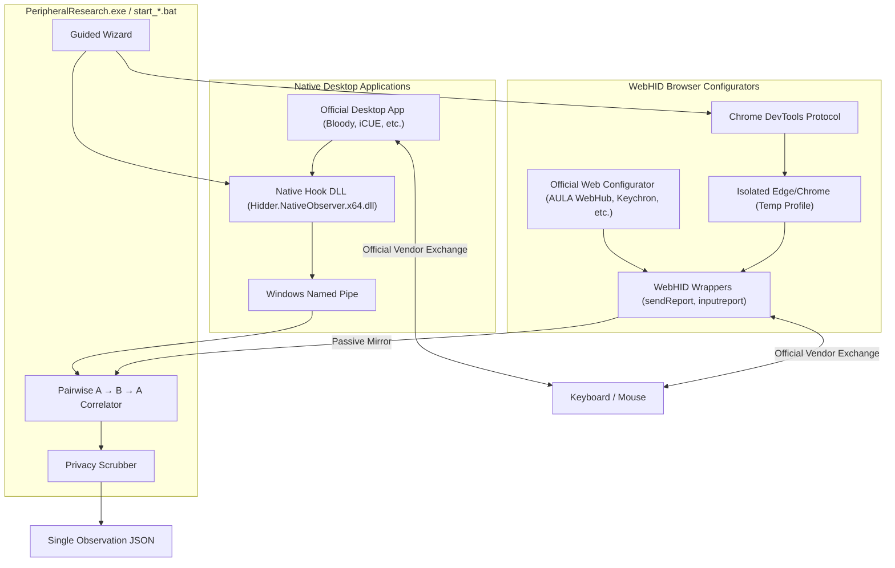

# Hidder — Research Probe for Vetro HUD

[]()
[]()
[]()
[]()

> 💡 **Community research tool for the upcoming Vetro HUD project**  
> This probe is designed to collect technical USB HID & WebHID protocol dumps from gaming keyboards and mice (Rapid Trigger, actuation depth, polling rate, lighting).  
> I don't physically own every peripheral on the market, so running this quick 5-minute session on your device **greatly helps add native support for your hardware in Vetro HUD**.

---

### 🛡️ Download & Security

* **Pre-built Releases**: Ready-to-use standalone executables are available on the [**Releases**](https://github.com/Phnem/Hidder/releases) page:
  * `PeripheralResearch_en.exe` (English)
  * `PeripheralResearch_ru.exe` (Russian)
* **VirusTotal Scan**: [VirusTotal Scan Report](https://www.virustotal.com/gui/file/db0af4862b66a85d742bc97bc9f13ca034cdb34a276170896a0f8f54fc113456/detection)
* **Don't trust pre-built binaries?** Clone the repository, inspect the source code, and run:
  * `start_en.bat` (English)
  * `start_ru.bat` (Russian)

  The BAT scripts automatically prepare an isolated `.venv` and launch Hidder **directly from repository source code**.

---

## 📸 Screenshots

| 1. Device Discovery & Selection | 2. WebHID & Desktop Observation |
| :---: | :---: |
|  |  |

| 3. Guided Action Windows & Final Export |
| :---: |
|  |

---

## 🎯 How This Helps the Project

Most peripheral brands (AULA, ATK, DrunkDeer, Lamzu, Attack Shark, Keychron, Bloody, Corsair, etc.) use closed, proprietary USB HID protocols.

To support your specific keyboard or mouse in Vetro HUD, we need to know the command structure:
1. You run the probe (~5 minutes).
2. Select your device and how you configure it (browser WebHID or desktop vendor app).
3. Follow on-screen prompts to change a couple of settings (e.g. toggle RGB mode or adjust actuation point).
4. The tool **passively records** the traffic sent by the official configurator and outputs a single `.json` file.
5. You send this JSON to me via Telegram ([@Phnem_pro](https://t.me/Phnem_pro)) or attach it to a GitHub Issue.

---

## 🔒 Privacy & Safety Invariants

* ❌ **Zero Hardware Writes**: The probe **never** sends its own commands or modifies firmware. The official vendor app remains the sole writer; Hidder is strictly a passive observer.
* ❌ **No Keystroke Logging**: Regular typing, passwords, and sensitive text input are never recorded.
* ❌ **Serial Numbers Scrubbed**: USB serial numbers and personal file paths are automatically stripped from the final JSON.
* ❌ **No System Installation**: No background services, kernel drivers, or registry startup entries are installed.

---

## 🏗️ How It Works (Architecture)

Hidder supports two passive observation modes:



1. **WebHID Mode (Browser Configurators)**:
   * Launches an isolated browser window with a clean temporary profile.
   * Intercepts `sendReport`, `receiveFeatureReport`, and `inputreport` streams via CDP.
   * Completely cleans up and removes the temporary profile on exit.
2. **Native Desktop Mode (Installed Applications)**:
   * Attaches to the selected vendor process with explicit user consent.
   * Filters packets strictly by target USB VID/PID.
3. **Pairwise $A \rightarrow B \rightarrow A$ Correlation**:
   * Compares state before change, during change, and after restoration to isolate exact byte offsets and configuration tables (such as Rapid Trigger).

---

## 🚀 Quick Start

### Option A: Pre-built Executable (Easiest)
1. Download `PeripheralResearch_en.exe` (or `_ru.exe`) from [Releases](https://github.com/Phnem/Hidder/releases).
2. Double-click the executable.
3. Follow the guided prompts (~5 minutes).
4. Send the generated `.json` file to Telegram [@Phnem_pro](https://t.me/Phnem_pro).

### Option B: Run Directly from Source
1. Clone the repository:
   ```cmd
   git clone https://github.com/Phnem/Hidder.git
   cd Hidder
   ```
2. Run the launcher:
   * `start_en.bat` (English)
   * `start_ru.bat` (Russian)

---

## 🛠️ Building from Source

### Prerequisites
* Windows 10/11 x64
* Python 3.10+
* Rust toolchain (`cargo`, `rustc`)
* PyInstaller (`pip install pyinstaller pytest pefile`)

### Build Both Executables
```cmd
python community/build_exe.py
```
Compiled standalone executables and cryptographic manifest will be placed in `community/dist/`.

### Run Test Suite
```cmd
python -m pytest -v community/tests DB/protocol-miner/tests
```

---

## 📄 License

This project is licensed under the MIT License.
